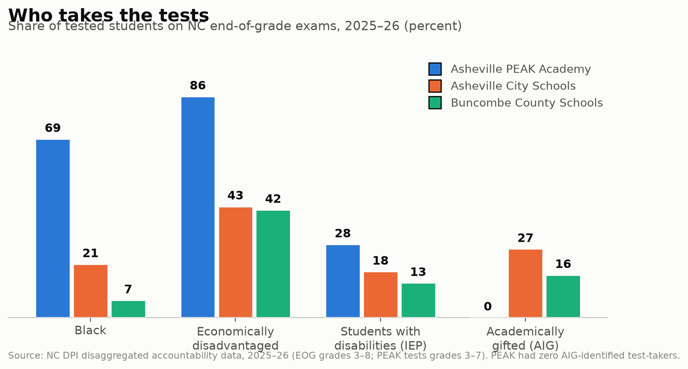
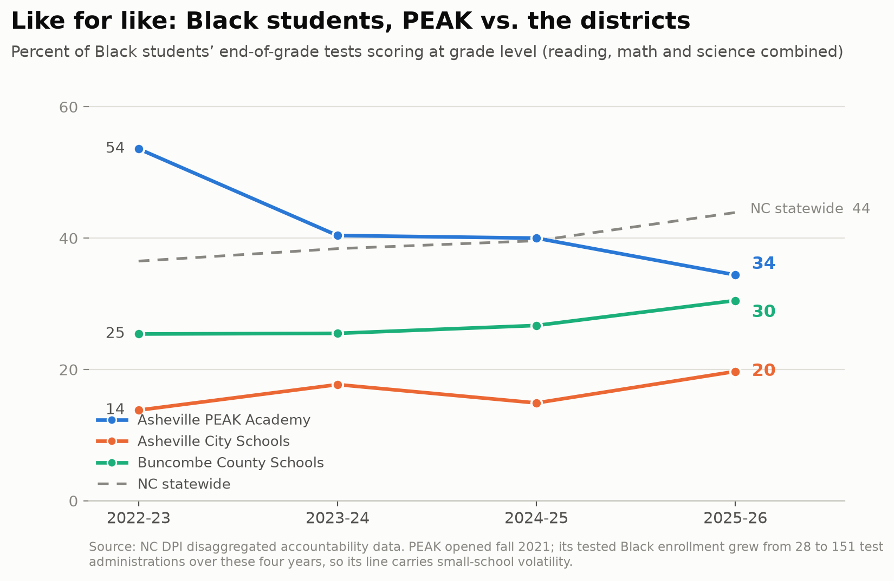

# What the state's own data says about Asheville PEAK Academy

**An analysis of NC DPI accountability data, 2018-19 through 2025-26, prepared to inform a response to coverage of PEAK's 2025-26 test scores.**

*Data: NC Department of Public Instruction disaggregated accountability files (Disag_2021-22 … Disag_2025-26, plus Disag_2018-19 as a pre-COVID baseline) and the 2024-25 / 2025-26 "School Assessment and Other Indicator Data" workbooks (EVAAS growth). All proficiency figures are "grade-level proficient" (GLP, achievement Level 3+), best-score including retests — the same accountability numbers WRAL's lookup tool publishes. Supporting extracts are in `data/`; charts in `charts/`.*

---

## The hypothesis being tested

> *PEAK serves a student population that historically underperforms and has been poorly served by the majority-white ACS and Buncombe County districts. As these students moved to PEAK, ACS and Buncombe's numbers rose — not because the districts improved, but because the neediest students left. Race and IEP comparisons should support or contradict this.*

**Verdict in one paragraph:** The first half of the hypothesis is overwhelmingly supported — PEAK's tested population is 69% Black, 86% economically disadvantaged, 28% students with disabilities, and 0% academically gifted, in a county where the districts' tested populations are ~59-64% white and 17-27% AIG, and where ACS has failed 80-87% of its Black test-takers every year on record. The second half — that district gains are an artifact of needy students leaving for PEAK — is **not** supported by the arithmetic and should not be the centerpiece of a response: PEAK is too small to move district averages more than ~1 point, Buncombe (23,000 students) gained *more* than ACS did, and the whole state rose in 2025-26. **But a related, better-supported claim survives:** ACS's celebrated 2025-26 gain is substantially compositional — its tested population became sharply less poor in one year (economically disadvantaged share down 5.6 points), and had its income mix stayed constant its gain would have been roughly +1.6 points, not +4.2. Meanwhile the strongest material for a rebuttal isn't compositional at all: **like-for-like, PEAK's students outperform the districts' comparable students, and the state's own growth model says PEAK students learned as much or more than expected in both of the last two years — including "Exceeded" during the hurricane year.**

---

## 1. Who PEAK actually serves

Share of tested students, 2025-26 EOG administrations (grades 3-8; PEAK tests 3-7):

| | PEAK | Asheville City | Buncombe County | NC statewide |
|---|---|---|---|---|
| Black | **69.3%** | 20.7% | 6.7% | 24.3% |
| White | 7.3% | 58.5% | 63.6% | 41.5% |
| Economically disadvantaged | **85.8%** | 43.1% | 41.8% | 48.4% |
| Students with disabilities (IEP) | **28.4%** | 17.8% | 13.4% | 14.1% |
| Academically gifted (AIG) | **0.0%** | 26.6% | 16.5% | 17.0% |
| Tested administrations | 218 | 3,483 | 22,665 | 1.6M |

Three things follow directly:

- PEAK's tested population is **3.3x** as Black as ACS's and **10x** as Black as Buncombe's, **twice** as poor, and carries **about double** the IEP share of either district.
- PEAK has **zero** AIG-identified test-takers. More than **one in four** ACS test-takers is academically gifted. Every AIG student is a near-automatic "proficient." Comparing PEAK's school-wide average to ACS's school-wide average is comparing a school with none of those students to a district where they're 27% of the denominator.
- PEAK's IEP share roughly **tripled** between 2023-24 (10.2%) and 2024-25 (31.4%), staying near there in 2025-26 (28.4%). The school got markedly *needier* over exactly the window in which its raw scores are being compared.

## 2. The population PEAK serves was demonstrably failed by ACS — that's why PEAK exists

ACS Black students' EOG proficiency (GLP, all subjects), 2018-19 → 2025-26:

| | 2018-19 | 2021-22 | 2022-23 | 2023-24 | 2024-25 | 2025-26 |
|---|---|---|---|---|---|---|
| ACS Black students | 22% | 13% | 14% | 18% | 15% | **20%** |
| ACS white students | 82% | 72% | 74% | 78% | 76% | **81%** |
| Black-white gap | 60 | 59 | 60 | 60 | 61 | **61** |

- The gap has been ~60 points in every year on record — long documented as one of the worst in North Carolina, and the explicit reason Black community leaders founded PEAK in 2020-21 ([Mountain Xpress](https://mountainx.com/news/charter-school-puts-a-dent-in-ashevilles-racial-achievement-gap/), [The Urban News](https://theurbannews.com/our-town/2020/the-story-behind-ashevilles-peak-academy-charter-school/), [Asheville Watchdog](https://avlwatchdog.org/legal-case-could-be-costly-for-peak-academy-which-was-established-to-close-student-achievement-gap/)).
- In 2025-26 — the year ACS is being praised for improvement — **four out of five Black students in ACS still tested below grade level in reading** (Black reading GLP: 19%).
- ACS's Black proficiency in 2025-26 (20%) remains **below its own 2018-19 level (22%)**. Seven years, no net progress for the students PEAK was created to serve.

## 3. Like for like: PEAK's students vs. the districts' comparable students

EOG proficiency (GLP, all subjects combined), by subgroup:

**2024-25** (the hurricane year — PEAK lost 22 school days to Helene):

| Subgroup | PEAK | ACS | Buncombe | NC |
|---|---|---|---|---|
| Black | **40%** (n=120) | 15% | 27% | 40% |
| Econ. disadvantaged | **46%** | 33% | 42% | 42% |
| Students w/ disabilities | **18%** | 16% | 14% | 19% |

**2025-26:**

| Subgroup | PEAK | ACS | Buncombe | NC |
|---|---|---|---|---|
| Black | **34%** (n=151) | 20% | 30% | 44% |
| Econ. disadvantaged | **41%** | 35% | 45% | 46% |
| Students w/ disabilities | **16%** | 21% | 16% | 21% |

- **PEAK's Black students have outscored ACS's Black students in every year of PEAK's existence** — by 2.7x in 2024-25 (40% vs 15%) and 1.7x in 2025-26 (34% vs 20%). They have also been at or above Buncombe's Black students in all four years on the combined measure.
- PEAK's economically disadvantaged students have beaten ACS's every year.
- PEAK's students with disabilities perform comparably to both districts' — while PEAK serves about **double the share** of them.
- Honesty note for the rebuttal: in *reading alone* in 2025-26, PEAK's Black students (26%) were above ACS (19%) but below Buncombe (31%), and PEAK trails the statewide Black average. Don't claim more than the data gives; the composite and multi-year pattern is strong enough without overreach.

## 4. The state's own growth model says PEAK students are learning

Raw proficiency measures who walks in the door. EVAAS growth — the state's value-added model — measures what the school adds. PEAK's official growth results:

| Year | Overall | Reading | Math | Black | Econ. disadv. | SWD |
|---|---|---|---|---|---|---|
| 2024-25 (22 days lost to Helene) | **Exceeded** (+2.93) | **Exceeded** (+3.17) | Met (+1.42) | **Exceeded** (+2.45) | **Exceeded** (+2.50) | Met (+1.37) |
| 2025-26 | **Met** (−1.24) | Met (−1.67) | Met (+0.08) | Met (−1.14) | Met (−1.68) | Met (−1.07) |

Context for 2025-26: every ACS school also "Met" (one Exceeded), and **10 of 43 Buncombe County schools failed to meet growth**. In the year PEAK is being written off, the state's own model says its students — overall and in every reported subgroup — learned at least as much as expected, and the year before (with 22 hurricane days lost) they learned *more* than expected, with reading growth of +3.17 among the strongest signals a small school can post.

## 5. The "collapse" at PEAK, under a microscope

WRAL's table (Math 52→49, Reading 48→39, Science 50→39) is accurate but describes a school of **~100 tested students**:

- **None of the three declines is statistically significant.** Two-proportion tests: reading p=0.23, math p=0.70, science p=0.50. The science "drop" is 18 test-takers — it is literally **two children**.
- **The entire reading decline sits in one incoming class.** Grade-by-grade reading:

  | Grade | 2024-25 | 2025-26 | Cohort view (same kids, one year later) |
  |---|---|---|---|
  | 3 (new to testing) | 50% (n=28) | **20% (n=30)** | — new cohort, arrived far behind |
  | 4 | 40% (n=15) | 50% (n=28) | G3→G4 cohort: 50% → 50%, held |
  | 5 | 39% (n=18) | 28% (n=18) | G4→G5 cohort: 40% → 28% (roster churned 15→18) |
  | 6 | 63% (n=16) | 55% (n=11) | G5→G6 cohort: 39% → **55%**, up sharply |
  | 7 (new grade) | — | 62% (n=13) | G6→G7 cohort: 63% → 62%, held at the school's high |

  If the new third-grade class had merely matched the *prior* year's third-grade class, PEAK's school-wide reading would have been **48% — identical to 2024-25**. The headline drop is the profile of the newest arrivals, not the trajectory of the students PEAK has been teaching. In math the same cohorts went 27%→39% (G4→G5) and 39%→**73%** (G5→G6).
- The school's tested body grew ~30% in one year (77→100 per subject) while adding a new top grade and absorbing an IEP share near 30%. A school whose mission is to admit students who are behind will *always* see its average diluted while it grows. Its first tiny cohort (2022-23, 18 students) posted 72% in math — the average fell as the school scaled precisely because it kept admitting the kids it exists for.

## 6. The districts' "improvement," under the same microscope

Year-over-year GLP, 2024-25 → 2025-26:

| | Reading | Math | Science |
|---|---|---|---|
| NC statewide | 52.5 → 55.7 (+3.2) | 56.7 → 59.6 (+2.9) | 61.0 → 68.1 (+7.1) |
| Asheville City | 57.8 → 61.1 (+3.3) | 53.3 → 57.2 (+3.9) | 64.5 → 71.3 (+6.8) |
| Buncombe County | 51.4 → 56.0 (+4.6) | 53.3 → 58.6 (+5.3) | 61.5 → 68.0 (+6.5) |

- **2025-26 was a rebound year everywhere.** The state rose ~3 points in reading and math and 7 in science (science had cratered statewide in 2024-25 with the new science test). Western NC districts were rebounding from a Helene-wrecked year on top of that. ACS's gains essentially *match* the statewide tide; Buncombe's slightly exceed it. Crediting district policy for riding a statewide rebound, while blaming a 200-student school for missing it, is the asymmetry a rebuttal can name directly.
- **ACS's gain is substantially compositional — by income, not race.** Decomposing ACS's +4.2-point composite gain: racial mix contributed ~0 (−0.8, actually slightly negative). But its economically disadvantaged share of tested students fell from **48.7% to 43.1% in a single year** (unique poor readers: 733→638; Buncombe: 4,587→4,072). Holding income mix constant, ACS's gain would have been **~+1.6 points, not +4.2**. Its poor students' reading was **flat at 34%**. So the "ACS improved" story is, to a first approximation: a statewide rebound, plus a tested population that got significantly less poor — most plausibly continued post-Helene displacement of low-income families (the poor-student decline is county-wide, ~610 students across both districts in one year, far beyond anything PEAK's ~20-student growth could absorb). *This is the defensible version of the hypothesis's second half — with displacement, not PEAK, as the mechanism.*
- ACS in 2025-26 is still **below its own pre-pandemic levels** (composite 61 vs 65 in 2018-19; reading 61.1 vs 65.4).

## 7. Directly testing "the neediest left, so district numbers rose"

- **Scale.** PEAK's entire tested body is 218 administrations vs ACS's 3,483 and Buncombe's 22,665. If every PEAK student were returned to ACS scoring exactly as they do at PEAK, ACS's overall rate would fall from 61.0 to 60.0 — **one point**. Assume instead they'd score like ACS's own Black/poor students (~25%) and it's −2.1 points for ACS and **−0.3 for Buncombe**. That's the *maximum level* effect of PEAK's existence; the effect on the one-year *change* (PEAK grew by only ~25 students) is a rounding error. PEAK cannot arithmetically explain district trends — and Buncombe, 100x PEAK's size, gained *more* than ACS.
- **The within-race version actually inverts.** Because PEAK's Black students outscore ACS's Black students, folding them back into ACS would *raise* ACS's Black subgroup rate (19.7% → ~22%). If PEAK were merely warehousing ACS's lowest performers, the opposite would be true. PEAK isn't draining high or low scorers — it's getting **better results from the same population ACS underserves**.
- **The flow is real, though.** Black tested readers: ACS 381 (2018-19) → 307 (2025-26); Buncombe 796 → 650; PEAK 0 → 69. PEAK now tests the equivalent of ~22% of ACS's Black tested enrollment. The honest framing: enough Black families have voted with their feet that PEAK now educates a meaningful share of the county's Black students — and gets better results with them — but their departure is *not* what's propping up district averages.

## 8. Scorecard on the hypothesis

| Claim | Verdict |
|---|---|
| PEAK serves a historically underperforming, underserved population | **Strongly supported** (§1, §2) |
| That population was poorly served by the majority-white districts | **Strongly supported** — 60-pt gap, ~80% of ACS Black students below grade level every year on record (§2) |
| Race/IEP comparisons favor PEAK like-for-like | **Supported with nuance** — Black and EDS students do better at PEAK than ACS every year; SWD comparable at double the share; one soft spot (2025-26 reading vs Buncombe's Black students) (§3) |
| District gains reflect composition, not improvement | **Partially supported** — for ACS, ~60% of the 2025-26 gain is income-mix; the rest tracks the statewide rebound. Not true for Buncombe (mostly real/rebound) (§6) |
| The mechanism is students leaving *for PEAK* | **Contradicted** — PEAK is 10-100x too small; the compositional shift is county-wide poverty displacement; within race, PEAK's absence *hurts* ACS's Black numbers (§7) |

## 9. Suggested spine for the response essay

1. **Name the statistical malpractice:** comparing a 218-test school that is 86% poor, 69% Black, 28% IEP and 0% gifted against districts whose tested rolls are ~60% white and 17-27% gifted — on raw averages, over a single pair of years, at a sample size where the science "trend" is two children.
2. **Aim the same lens back:** ACS's average has always looked respectable while 4 of 5 of its Black students test below grade level — that average is precisely how Asheville hid its gap for a generation, and it's why PEAK exists.
3. **Bring the two numbers that measure the school, not the intake:** growth Exceeded (2024-25, 22 hurricane days lost) and Met (2025-26, every subgroup), while 10 Buncombe schools failed growth; and cohorts — kids who stayed at PEAK held or gained (G5→G6 reading 39→55, math 39→73), and the "decline" is one incoming class of third-graders who arrived behind. Serving them is the mission, not the scandal.
4. **Concede honestly, then reframe:** yes, 39% reading proficiency isn't the destination, the new G3 class has a long way to go, and 2025-26 growth was "Met," not "Exceeded." But the districts' rise rode a statewide rebound plus a tested population that got measurably less poor — while the school being attacked posted better results with the county's most underserved students than either district gets with the same students.
5. **What not to claim** (protects the piece's credibility): don't say PEAK outperforms the districts overall; don't say the districts' gains are fake (Buncombe's are mostly real); don't attribute district gains to PEAK departures — the numbers can't carry it, and the piece doesn't need it.

---

### Methodology notes

- "Tested" composition = share of EOG test administrations (each student takes 2-3 EOGs); subgroup proficiency uses DPI's own subgroup denominators. PEAK per-subject unique students: 100 reading/math, 18 science (2025-26).
- GLP = Level 3+ ("grade-level proficient"), type=ALL (includes NCEXTEND1 and best-score retests) — matches WRAL/accountability figures exactly (verified against PEAK's Spring 2026 School Summary, code 11F000).
- Suppressed cells ("<5"/" >95") imputed at 2.5/97.5 where needed; PEAK's white subgroup is too small for stable rates before 2025-26.
- Decomposition: Δoverall = Σ(avg share × Δrate) + Σ(avg rate × Δshare), standard within/mix split; race and income partitions reported separately (both are true simultaneously: the mix shift happened on income, not race).
- Significance: two-proportion z-tests on GLP counts, PEAK 2024-25 vs 2025-26 (reading z=1.21, p=0.23; math z=0.38, p=0.70; science z=0.67, p=0.50).
- Sources: [DPI accountability data sets](https://www.dpi.nc.gov/districts-schools/testing-and-school-accountability/school-accountability-and-reporting/accountability-data-sets-and-reports), [disaggregated datasets directory](https://accrpt.tops.ncsu.edu/docs/disag_datasets/), 2024-25 & 2025-26 School Assessment and Other Indicator Data workbooks (EVAAS growth sheets, incl. "Days Missed Due to Hurricane Helene"), [WRAL score lookup](https://www.wral.com/news/education/look-it-up-nc-standardized-testing-results-september-2026/).

## Chronic absenteeism, sliced by Black and low-income students

Source: DPI school report card dataset `rcd_chronic_absent` (SY2425 release). Definition: share of
students enrolled ≥10 days who missed ≥10% of their enrolled days. `year` = spring of the school year
(2025 = 2024-25); report cards lag accountability, so 2025-26 is not yet published. Rates `<5`/`>95`
are masked to 5/95; cells with denominator <10 are suppressed. Full extract:
`data/chronic_absenteeism_2018-2025.csv`.

### The headline: PEAK's Black and low-income students show up at ~half everyone else's absentee rate

2024-25 chronic absenteeism (count/denominator):

| Group | PEAK | Asheville City | Buncombe County | NC statewide |
|---|---|---|---|---|
| Black students | **17.7%** (20/113) | 34.7% (256/738) | 31.2% (514/1648) | 31.4% |
| Low-income (EDS) | **17.3%** (26/150) | 30.2% (557/1843) | 27.3% (2853/10434) | 33.2% |
| All students | 20.0% (34/170) | 20.1% (804/4007) | 18.7% (4292/22916) | 24.3% |
| With disabilities (SWD) | 25.0% (5/20) | 27.7% | 28.7% | 31.2% |

Unlike the test-score cells, these denominators cover the whole school (K up, not just grades 3-8),
and every headline gap is statistically significant (two-proportion z):
PEAK vs ACS Black z=−3.59 p=0.0003; vs BCS Black z=−3.02 p=0.0025; vs ACS EDS z=−3.34 p=0.0008;
vs BCS EDS z=−2.74 p=0.006; vs statewide benchmarks Black p=0.0017, EDS p<0.0001.

### PEAK improved every year it has existed — significantly

| Year | PEAK all | PEAK Black | PEAK EDS |
|---|---|---|---|
| 2021-22 | 34.1% (29/85) | 32.1% (18/56) | 36.2% (21/58) |
| 2022-23 | 24.5% | 26.6% | 28.8% |
| 2023-24 | 23.3% | 23.5% | 24.8% |
| 2024-25 | 20.0% | 17.7% | 17.3% |

2021-22 → 2024-25: all p=0.014, Black p=0.034, EDS p=0.0035 — real improvement at school scale,
through a doubling of enrollment and the Helene year.

### Position among NC schools (2024-25)

- Black-student absenteeism: PEAK lower than **80%** of the 2,264 NC schools reporting the subgroup.
- Low-income absenteeism: lower than **88%** of 2,614 schools.
- Poverty-adjusted (OLS of all-student rate on EDS share, N=2,568 schools ≥50 students; slope ≈ +42
  points per 100% EDS): a school with PEAK's 88% EDS share is predicted at 39.5%. PEAK is 20.0% —
  **19.5 points better than predicted, a residual in the best 1% of NC schools**.
- Among the 293 high-poverty schools (EDS ≥75%): median 36.6%; PEAK better than 94% of them.

### The equity gap runs the other way at PEAK

Everywhere else, Black students are chronically absent *more* than the average student:
ACS +14.6 pts above its own average (Black 34.7 vs all 20.1; Black-white gap +21.4), BCS +12.5,
state +7.2. At PEAK, Black students are absent *less* than the school average (−2.3 pts). The
attendance gap that mirrors the districts' achievement gap does not exist at PEAK.

Caveats: EDS denominators change definition between 2022 and 2023 (direct-certification expansion),
so within-district EDS trends across that seam are unreliable — cross-sectional comparisons are
clean. 2019-20 is a truncated COVID year and 2020-21 rates are pandemic-inflated everywhere;
comparisons here start at 2021-22, PEAK's first year of operation.
